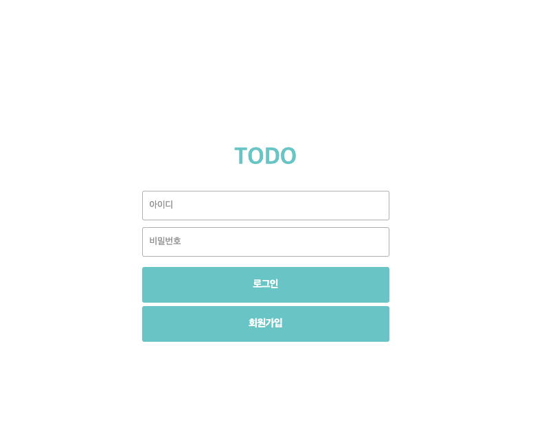
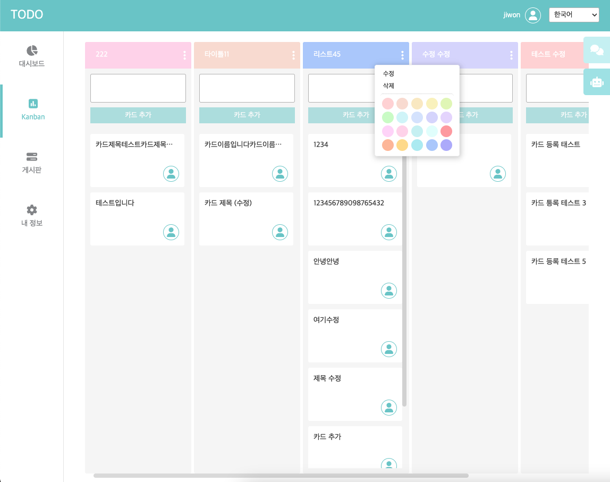
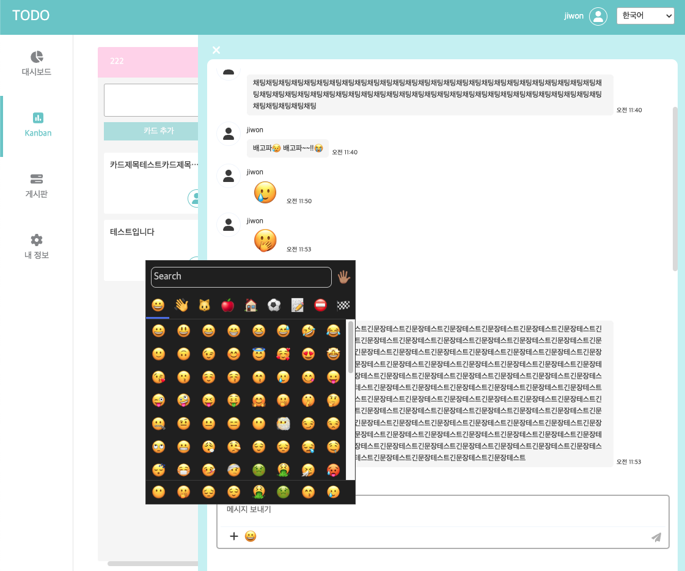

# TODO

# Tech Stack
- Vue3
- Express (Sequelize)
- MySQL
- MQTT (tree broker : https://www.emqx.com/en/mqtt/public-mqtt5-broker)
- WebSocket (socket.io, vue-socket.io)
- Sass, Font Awesome
- i18n (vue-i18n)
- JWT (jsonwebtoken)
- vue-chart-3, chart.js
- emoji (vuemoji-picker)
- swagger (swagger-jsdoc, swagger-ui-express)


# Script
```
npm install
```
```
npm run serve    // frontend
npm run startdev // backend
```
```
npm run build
```

# Page

### Login & Join
- JWT (jsonwebtoken)



### Kanban 
- vuedraggable
- MQTT



### Card Detail (in progress)
- Tiptap editor (+ProseMirror editor custom)

### Chat
- socket.io, vue-socket.io
- emoji (vuemoji-picker)



### Dashboard (in progress)
- vue-chart-3, chart.js
- 

### Board (todo)
- simple crud


# TO DO
- file upload
- add card, checkList Assignee
- 